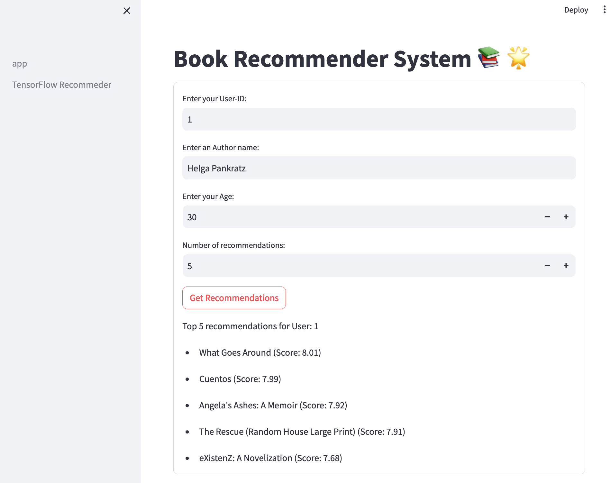

# Book Recommender
This repository contains code for building a book recommender systems using **Tensorflow Recommenders**.




# Data
The dataset for this project can be found in this [github](https://github.com/caserec/Datasets-for-Recommender-Systems/tree/master/Processed%20Datasets/BookCrossing).

Book Crossing dataset were collected by Cai-Nicolas Ziegler in a 4-week crawl (August / September 2004) from the Book-Crossing community with kind permission from Ron Hornbaker, CTO of Humankind Systems.

This data has been organized and cleaned up by Arthur Fortes [1] based on MovieLens 100k treatment [2], which removed all users and items who had less than 20 and 10 interactions, receptively, items that have no information and separated in files the explicit and implicit interactions.


# Getting Started

To use this application, you need to set up your environment. And, please ensure you have: 
- anaconda / miniconda in your machine. If not, please check the [installation documentation](https://docs.anaconda.com/free/anaconda/install/index.html)

Now follow the instruction bellow:

## Setting up Environment
Open a terminal and navigate to the root directory of your repository, then run the following command:

```
conda create --name <env-name> python=3.11
```
replace `<env-name>` with the name of your conda environment.


## Activate the Conda Environment
After creating the environment, you can activate it using the following command:

```
conda activate <env-name>
```
## Install Dependencies

```
pip install -r requirements.txt
```

## Run the Application
You can now run the Book Recommender application. Navigate to the root directory of the repository and execute the following command:

```
streamlit run app/app.py --server.address="0.0.0.0"
```

# REFERENCES

[1] Da Costa, Arthur Fortes. PhD candidate at the Institute of Mathematical and Computational Sciences, University of São Paulo. URL: https://arthurfortes.github.io/

[2] MovieLens 100K Dataset. Stable benchmark dataset. 100,000 ratings from 1000 users on 1700 movies. Released 4/1998. URL: https://grouplens.org/datasets/movielens/100k/ Generated by GroupLens [Department of Computer Science and Engineering at the University of Minnesota].


Content-based filtering uses **item features** to provide recommendations
Collaborative filtering uses similarities between users and items simultaneously to provide recommendations